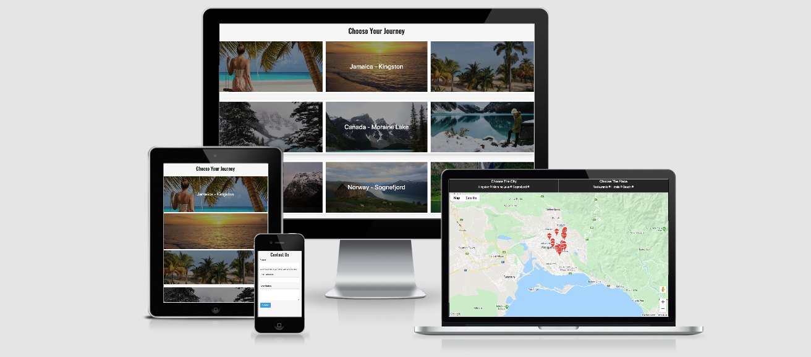

# Holiday Planner

This is the second milestone project. The Idea of this project was to create a website that would help to plan the holiday. Provide an idea where is the place, see what places the travelers can visit being over there, all of that can be seen on Google map. 
Hosted on [GitHub Pages](https://rimantascode.github.io/Milestone-Project-2/)
Repository on [GitHub](https://github.com/rimantascode/Milestone-Project-2)

## License

The project is shared for use with the [GNU General Public License v3](https://github.com/Pattern-Projects/oireachtas-ifd-project/blob/master/LICENSE)

   This program is free software: you can redistribute it and/or modify
    it under the terms of the GNU General Public License as published by
    the Free Software Foundation, either version 3 of the License, or
    (at your option) any later version.

## UX


This website consists of 4 parts. In the 1st part of this website, visitors can see 3 places to visit with high-quality pictures - Jamaica Kingston, Canada Moraine Lake, Norway Sognefjord. By hovering over the section of the place is slightly separated and by clicking on the particular section (or place to visit) the visitor is taken to the map which is the section 2 where they can see that place on the map and by changing options with radio buttons the visitors can see where are the restaurants, hotels, and beaches, the markers give a and idea if the place is open and when the users click on the marker they can see some information picture, place name, rating, the other bits of information is provided according to what the google provides, some places might have a feature how much time left until the place close if closed it might provide when it is opened a link to see the place on google maps. Address and the phone number.3. The section contains a contact form, by filling in the visitor can contact the service provider with any questions. 4. The section is a footer containing links to social platforms.
The design is responsive and can be easily navigated on any size of the screen.
The mock-up looks a bit different than the mockup, it is because I decided not to have a slider but have just 3 sections with pictures, to keep the website simple and display the information clearly, to let the visitors search threw the website quickly.

### Users 

The users group will be any user with an inten to travel to Jamaica Kingston, Canada Moraine Lake, Norway Sognefjord. 

### Design

- Colour scheme consists of few colours, was used website to blend the colors.
   (https://meyerweb.com/eric/tools/color-blend/#:::hex)
    -  `#f7f7f7`
    -  `#29a5e2`
    -  `#666666` 
    -  `#ffffff` 
    Bottstrap card class bg-danger
    
    
-  font used throughout the website
    - font-family: 'Comfortaa', 'Prompt','Roboto', sans-serif;

### Mockups
The mock-up looks a bit different than the mockup, it is because I decided not to have a slider but have just 3 sections with pictures, to keep the website simple and display the information clearly, to let the visitors search threw the website quickly.
- [Mockup](documentation/full-stack-web-developer-milestone.pdf)  


## Features

Features planned, implemented and outlined for later development 

### Planned Features
- Documentation - ReadMe File, Licence & Mockups
- Colour Scheme
- slider
- Favicon
- Bootstrap - HTML, CSS Framework
    - Grid System - Columns and Rows
- Responsive design - Mobile First
- UX elements
    - Animations
- Accesibility
- contact Form
- Git - Version Control System
- GitHub - Remote Repository
- Deployed - Hosted on Github Pages

### Existing Features
- Documentation - ReadMe File, Licence & Mockups
- Colour Scheme
- Bootstrap - HTML, CSS Framework
    - Grid System - Columns and Rows  
- Responsive design - Mobile First
- UX elements
    - Animations
- Accesibility
- Gitpod - Version Control System
- GitHub - Remote Repository
- Deployed - Hosted on Github Pages


### Features Left to Implement
- custom logo
## Technologies Used
This project makes use of:
- [HTML](https://developer.mozilla.org/en-US/docs/Web/HTML)
    - HTML for strucutre
- [CSS](https://developer.mozilla.org/en-US/docs/Web/CSS)
    - CSS for Styling
- [JavaScript](https://simple.wikipedia.org/wiki/JavaScript)
    - JS for creating dynamic functions, manipulating google places api.
- [jQuery](https://en.wikipedia.org/wiki/JQuery)
    - jQuery very usefull for traversing and events handeling
- [Google Places API](https://developers.google.com/places/web-service/intro)
    - Google Places API to request an iformation for particular places
- [Google Chrome](https://www.google.com/chrome/)
    - Used for browser and dev tools
- [Mozilla Firefox](https://www.mozilla.org/en-US/firefox/new)
    - Used for browsing and testing responsiveness.
- [Google](https://www.google.com/)
    - **Google** was used for research, workm and testing responsiveness
- [Bootstrap](https://getbootstrap.com/)
    - HTML and CSS Framework from **Bootstrap**
- [Gitpod](https://www.gitpod.io/)
    - **Git** used for Version Control
- [GitHub](https://github.com/)
    - Repository hosted on **GitHub**
- [Github Pages](https://rimantascode.github.io/milestone-profile2/)
    - Website hosted on **Github Pages**
- [Am I Responsive](http://ami.responsivedesign.is)
    - Testing responsiveness of the website **Am I Responsive**
- [Figma](https://www.figma.com/)
    - used to make a mockup

## Testing
    Tested on Mozilla firefox, Opera, Google Chrome and Safari browsers looked good responsive design.
    sent few links to my friends and relatives, the feedbacks were good.

## Deployment

The project is hosted on [GitHub Pages](https://rimantascode.github.io/Milestone-Project-2/)

The process involved:
- Host a git repository on GitHub. Explained [here](https://help.github.com/en/articles/create-a-repo).
- The root folder contains README.md and index.html files
- On GitHub repository settings page move to GitHub Pages section
- Change source to master branch. (Or any desired branch)
- Provided link will be your projects home (index) page.
 
To deploy your own version of the website:
- Have git installed
- Visit the [repository](https://github.com/rimantascode/Milestone-Project-2)
- Click 'Clone or download' and copy the code for http
- Open a terminal in your root directory
- Type 'git clone ' followed by the code taken from github repository
    - ```https://github.com/rimantascode/Milestone-Project-2.git```
- When this completes you have your own version of the website
    - Feel free to make any changes to it
- The website can be run by opening one of the HTML files within a web browser
- Visit the link provided
- Your website with any made changes will appear
- Saved changes to the website will appear here after refreshing the page

The benefits of hosting your website on GitHub pages is that any pushed changes to your project will automatically update the website. Development branches can be created and merged to the master when complete.

It may take a moment for changes to appear on the hosted website.

## Credits
 - [w3schools](https://www.w3schools.com/css/css3_shadows.asp)
    - Box shadow was coppied and modified.
- [code Institute](https://code-institute-solutions.github.io/StudentExampleProjectGradeFive/)
    - used and idea of the pie diagram.
-  [readme](https://github.com/Pattern-Projects/oireachtas-ifd-project/tree/master)
    - used as I guidence for my own readme.md
- Work History style coppied and modified from Code Institute lessons.
### Media

#### Thank you very much fro all the source for amzing quality of the pictures.

 - Thank you [https://fshoq.com](https://fshoq.com/free-photos/p/167/woman-on-swing-caribbean-beach-and-sea) for a picture
 - Thank you [www.pxfuel.com](https://www.pxfuel.com/en/free-photo-jlzhv) for a picture
 - Thank you[https://pixabay.com/](https://pixabay.com/photos/jamaica-palm-trees-beach-1303880/) for a picture
 - Thank you [https://pixabay.com/](https://pixabay.com/photos/woman-hike-lake-female-hiker-2896389/) for a picture
 - Thank you [https://wikimedia.org/](https://upload.wikimedia.org/) even ehen the picture is no availble any more
 - Thank you [https://www.flickr.com/](https://www.flickr.com/photos/bods/6062033422) for a picture.
 - Thank you [https://commons.wikimedia.org](https://commons.wikimedia.org/wiki/File:The_Sognefjord.jpg) for a picture
 - Thank you [https://www.flickr.com/](https://www.flickr.com/photos/paszczak000/4669043022) for a picture
 - Thank you [https://www.flickr.com/](https://www.flickr.com/photos/redjunasun/5937648493) for a picture

### Acknowledgements
Thank you inspiration, very usefull guidence and tips:

- Seun Owonikoko    @seun_mentor
- Code Institute